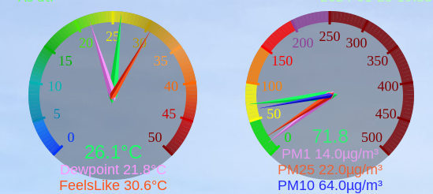
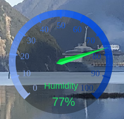
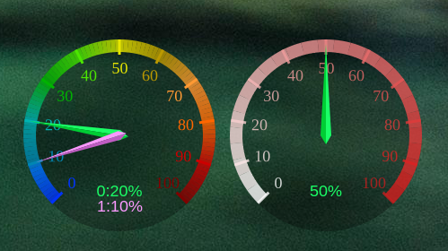

# The Dials Library and Reference Implementation

[dials.lua](./dials.lua) is a library I wrote for Lua that can render round dials with (or without) gradients using Cairo.  I have provided a reference [conky](./cpu.conf) and [lua](./cpudial.lua) script that utilise the library.

Please be advised I offer no support: these work for me.  The documentation provided will hopefully be enough to get people with Lua and Ciaro skills to get working or incorporate into their projects.  They were written for my use case, and may not be suitable for yours. 

The Library offers two different types of dials, with support for as many "needles" as you like.  You can customise 

1. The radius of the dials
2. The font size for the numbers
3. The maximum and minimum numbers (they'll be divided into 10 equal increments)
4. The background colour and transparancy
5. The size of the "ticks" used for the dial.
6. The size of the line used for the dial
7. Other things specific to each class; check the code comments.

`RGBDial` is a class that can provide a dial with or without gradients.  It supports 11 colour "stops" (for 10 equal arcs), if you need less, just make the stops the same colour.  Here they are showing temperature (with gradient) and Particulate Matter Air Quality (no gradient).

`HSVDIAL` is a class that provides a dial with a gradient by providing a base hue, saturation, and volume: the volume is then varied to create a "light to dark" dial; great for percentage scales.

For all dials, the text placement of readings is up to you (but the demo script shows you a way).

## Conky demo

[cpu.conf](./cpu.conf) is a Conky configuration that demos the two dials, however, they may be a bit resource hungry with such fast refresh rates.  You can decide for yourself.  My use case was environmental data (obvious from the screenshots) that only refreshes every minute.

This will show the usage of CPU0 and CPU1 (so you CPU should be at least dual core), along with memory used.

*Make sure you change `cpu.conf` conky file's `lua_load` property to the absolute path to the lua script.*

Checkout the demo [conky](./cpu.conf) and accompanying [lua script](./cpudial.lua) to see it in action.  There are plenty of comments in the Lua script to demo their usage.

## Libaray Usage

You can use `dials.lua` as a library using lua's `require` function.  You may need to set the `package.path` in lua to include the dial library's full path.  While they may run from your command line, there can be problems locating `dials.lua` if running at startup in your startup scripts when you window manager starts.

Please refer directly to the library or demo script on the configuration available and how to use.

### Needles

There are "default" needles found in `dials.lua` as `Common.Needles` object.  These contain four needle sizes, defined as vectors.  They are asymetric diamonds lying on the x-axis.  They should work for the default radius of 100 pixels, but anything larger or smaller you'll need to adjust.

### Function: new

Will create a new dial instance.  The object is optional.  If not provided, all default values are used.  You can provide an object with whatever overrides youu want, the creator will check for `nil` values and set to defaults.  Check the comments in `dials.lua` describing the object's values and what they mean.

### Function: Draw

Will draw the dial with appropriate radius, line thickness, ticks and numbers based on provided parameters.  Check the code comments for parameter usage.

### Function: placeHandOnDialShade

Will draw the hand on the dial pointing to the value.  Check the code comments for parameter usage.

### Common object

This contains utility classes that are not documented.  There are two useful things in it.

1. `Common.Needles` defines the needles you can use for the dials to set your values.
2. `Common.setRGBFromHSV` as Ciaro only understands RGB-alpha color, this function will convert HSV to RGB and set the colour
