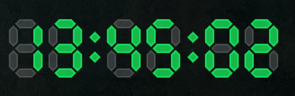
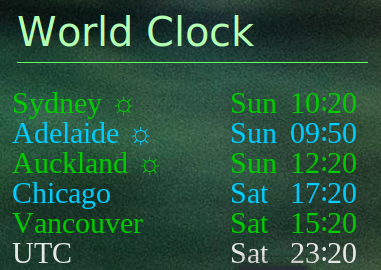

# Conky, Lua, and Cairo: Eye Candy Cubed

Welcome to my sample [Conky](https://github.com/brndnmtthws/conky), [Lua](https://www.lua.org), and [Cairo](https://www.cairographics.org) scripts.

If you love the eye candy Conky offers for your desktop, and refuse to move to Wayland until Conky works properly in it, you've come to the right place.

These scripts are ones I built for fun and to remind myself of all the math involed in graphics programming.  These include

1. [Clocks](./README.md#clocks) - various clocks documented below.
2. [Dials](./README-DIALS.md) - a library and demo on a round dial for a retro looking guage (documented separately).  This is for more advanced use.

Conky, Lua, and Ciaro are available in most Linux distros, so consult your disto docs or forums on how to install them.  Conky is a native X application, it does *not* work well in Wayland without doing some work, which I cannot describe as I don't use Wayland.  So many "standard" Linux Window Environments such as Gnome and KDE will need further configuration to make them look nice.

I have tested on both Garuada Linux on an x86 and Debian (Raspberry Pi OS) on a Raspberry Pi 3 and 4; all running the [i3](https://i3wm.org/) window manager.

They use the "Liberation Sans" font.  Given the nightmare of Linux and Fonts (or just fonts in general), I cannot guarantee you have that font.  So if you get missing font errors, try to find a font that works for you.

They are free to use, or review for inspiration for your own projects, or just brush up on your rotational geometry and linear transformation skills.  Please don't expect any support, they are for people who can use Conky; understand programming; along with the maths involed in graphics programming.

## Running

First, *make sure you change `.conf` conky file's `lua_load` property to the absolute path to the lua script.*

You can run these by providing Conky with the `.conf` file.  e.g. in the directory where you have put the config files (or provide the full path)

```
conky -c ./analog_clock_big.conf
```

All will appear in the bottom right of your screen, this is my "wildcard" space where I run the Conky I feel like.  

### `toggleconky.sh` Utility Bash Script

The `toggleconky.sh` script is a utility script that takes the name of the Conky configuration file as a parameter and 

1. If the Conky is running, it kills it.
2. If the Conky is not running, it starts it.

Great script for your keybindings as you can assign different keybinding to start/stop different Conky's.  To use, you'll need to make executable and modify the path to where you put the config files.

```bash
if [ -z "$PID" ]; then
	#echo 'not found...start'
	## CHANGE THIS !!
	conky -c /path/to/config/directory/$CONFIG
#and so on
```

Also useful when debugging Lua, and it starts spaffing all sorts of errors on your terminal.  You'll need to make the script executable and can then use it to launch your conky.

## General Notes

- I like dark desktop backgrounds, so the colours are optimised for that.  I never took the time perfecting colours, but you can change the colours if you wish.  Instructions show you where.
- I don't believe these have too much overhead, but you're mileage may vary.  I don't vouch for efficiency.  They work for me, and I don't have a powerful CPU or graphics.
- Once again, these are free and open source (MIT License).  Note Conky, Lua, Ciaro may be under different Licenses.
- No support is offered; they work for me.  Suggestions or pull requests are welcome.

## Clocks

I experimented with clocks, both analoge and digital ones using Lua scripting and the Cairo graphics library.

Since we need to work with milliseconds, the Lua scripts require the "socket" library.  Again, you'll need to explicity install it from your distro, if it was not included.

All the digital clocks are 24 hour time.  

### analog_clock_big

This script and accompanying Lua file will show a large analog clock (with an inner 24hr clock) complete with sweep second hand.  It takes two co-ordinates, the x and y position for the centre of the clock.  There's probably no reason to change this unless you plan to run other scripts in the same window.


It is two coloured : Green and Blue.  You can change the colours at the start of the conky function

```lua
function conky_clock(ctrx, ctry)
	if conky_window == nil then return end
	--RGB values for colour
	r_green=26/255
	g_green=1
	b_green=102/255

	r_blue=0
	g_blue=102/255
	b_blue=1
    --and so on
end
```

### digital_clock

This script displays a retro, segmented LED digital clock - state of the art tech in the 1970's.  Two segments defined as vectors (for horizontal and vertical) are translated about to create the segments; arrays define which segments are on or off.  The colons flash also.



There are three parameters.  The first are the x, y co-ordinates to place the top left corner of the clock in the window.  The second is scale, you can scale the size up or down, depending on how big you want it.  Use numbers less than 1 for smaller, but it does get messy if too small.  You'll probbably have to experiment with x, y placement if you scale it.

You can change the colours if you wish.  They are defined near the top of the script in the code for when a segment is on or off. The clock also uses an alpha (transparancy), but changing that requires you to find in the code. 

```lua
--RGB of onoff
rgbOn={26/255, 1, 102/255}
rgbOff={0.8,0.8,0.8}
```

### flip_clock

Prior to the massive breakthrough of segmented LEDs that came in the 1970s for digital clocks, older folk would remember the mechanical flip clocks of the 1960's.  This clock emulates that: the "Analog Digital Clock".


It takes one parameter, but that doesn't do anything.  Maybe there for a feature I plan to add in the future.  You can change the colour and font of the text by changing the code directly.

```lua
function conky_clock(correctOffset)
	-- some deleted code
	  	
	-- text
	cairo_select_font_face (cr, "Liberation Sans", CAIRO_FONT_SLANT_NORMAL, CAIRO_FONT_WEIGHT_NORMAL)
	cairo_set_font_size (cr, 55)
	cairo_set_source_rgba (cr,26/255,1,26/255,1)

    --more deleted code
end
```

Its not "internationalised", but if you prefer the Day of Week in your language, just change the array at the top starting from what the English call "Sunday" and the French call "Dimanche". 

```lua
days={"Sun", "Mon", "Tue", "Wed", "Thu", "Fri", "Sat"}
```

### world_fadeclock.conf

This leverages the `fadeclock.lua` script, which also has a sister script `secondsfadeclock.lua` that includes seconds (the world clock is only in minutes).  The fadeclock numbers will fade out the old and fade in the new from 55seconds to the top of the minute (5 seconds).  You can watch it tick over at midnight for the full `oooooohhhhh`.

It show the day of week, a daylight savings indicator (if the time is DST), your city name (you choose that). and the time in 24h format.



This takes several parameters.

```lua
function conky_tz(tz, city, ymin, r, g, b)
```

- `tz` is the timezone string used by the Linux TZ database.  Find a city that is in your timezone (e.g. "Australia/Melbourne")
- `city` is the string of the name you want to see in your clock.  E.g. You may not want to admit you live in Melbourne, so you can display "Ararat".
- `ymin` This is the y-co-ordinate of the clock (top left corner), so that you can display multiple cities for the true world clock experience.
- `r`, `g`, `b` - 0-255 Red, Green, Blue values for the colour of the clock.  Lua uses decimals, but many web people are used to the 8-bit colour depth standard, so you can provide 8-bit integers.

Like the flip clock, if you prefer the Day of Week in your language, just change the array at the top starting from what the English call "Sunday" and the French call "Dimanche". 

```lua
days={"Sun", "Mon", "Tue", "Wed", "Thu", "Fri", "Sat"}
```